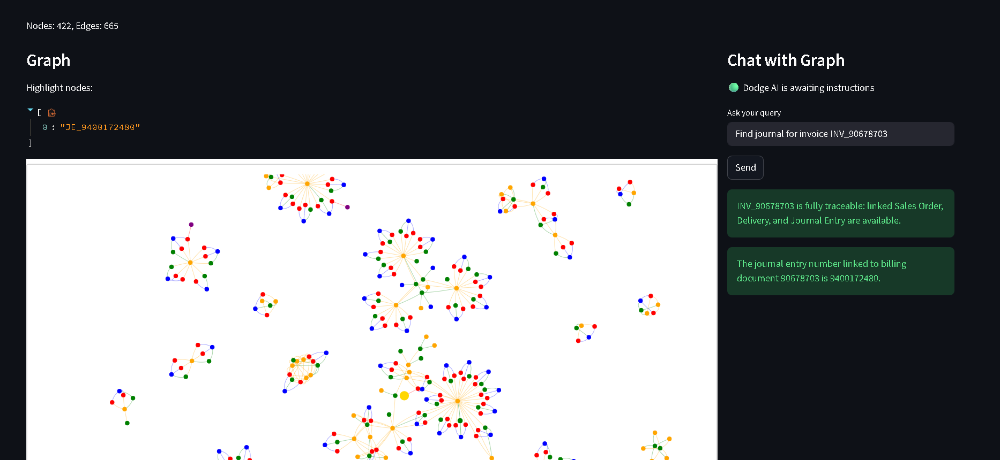
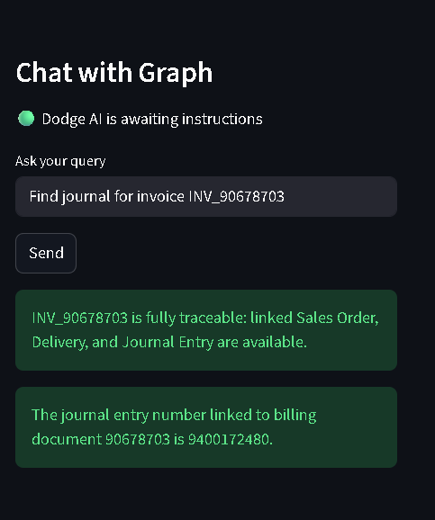

# 🧠 Order-to-Cash Graph AI

A Graph-based AI system to analyze Order-to-Cash (O2C) workflow using natural language queries with interactive visualization.

---

## 🚀 Project Overview

This project converts complex business data (Orders, Deliveries, Invoices, etc.) into a **graph structure** and allows users to query relationships using **natural language**.

Instead of manually searching across multiple tables, users can simply ask:

👉 *"Show all deliveries for order X"*  
👉 *"Which invoices are pending?"*

---

## ⚙️ Tech Stack

- Python 🐍
- Streamlit 🎯 (UI)
- NetworkX 🌐 (Graph modeling)
- Matplotlib 📊 (Visualization)
- Groq API 🤖 (LLM integration)

---

## 🧠 Features

- 📌 Converts structured data into graph format
- 🔗 Connects Orders → Deliveries → Invoices → Payments
- 💬 Natural Language Query Interface
- 📊 Interactive Graph Visualization
- ⚡ Fast processing using LLM + graph logic

---

## 📸 Screenshots

## 📊 Graph Visualizations

### 🔹 Query Interface

---

## 🗂️ Project Structure

